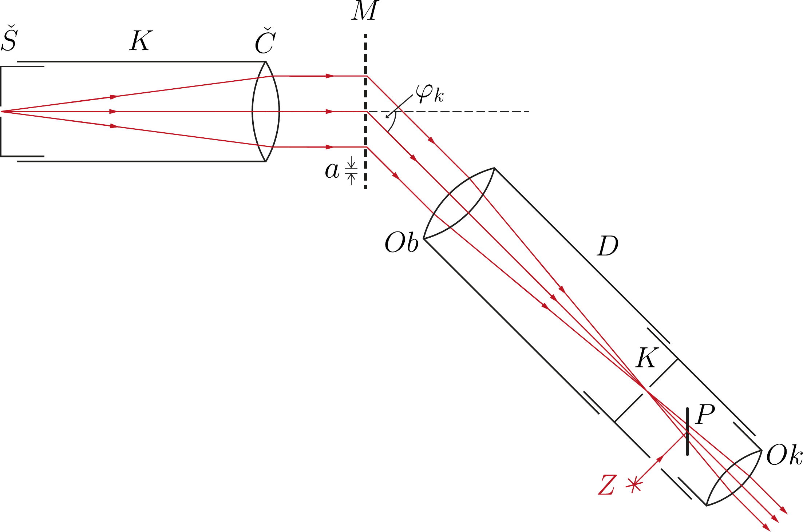
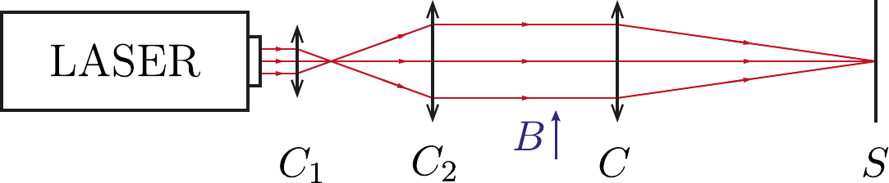
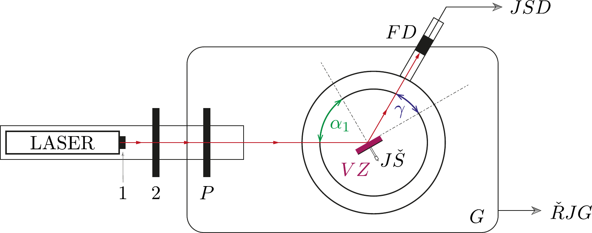
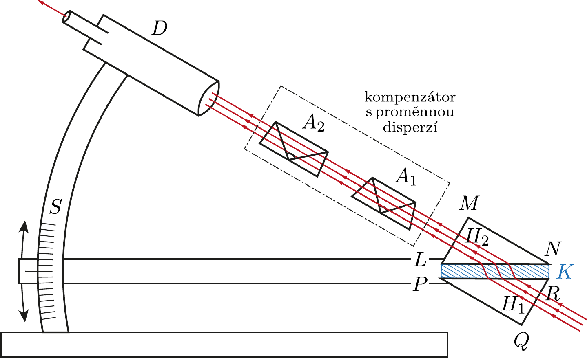
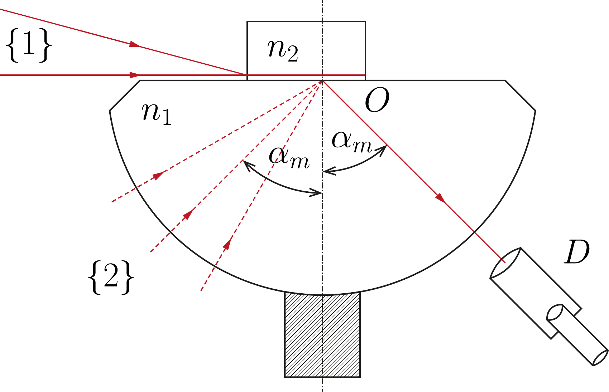
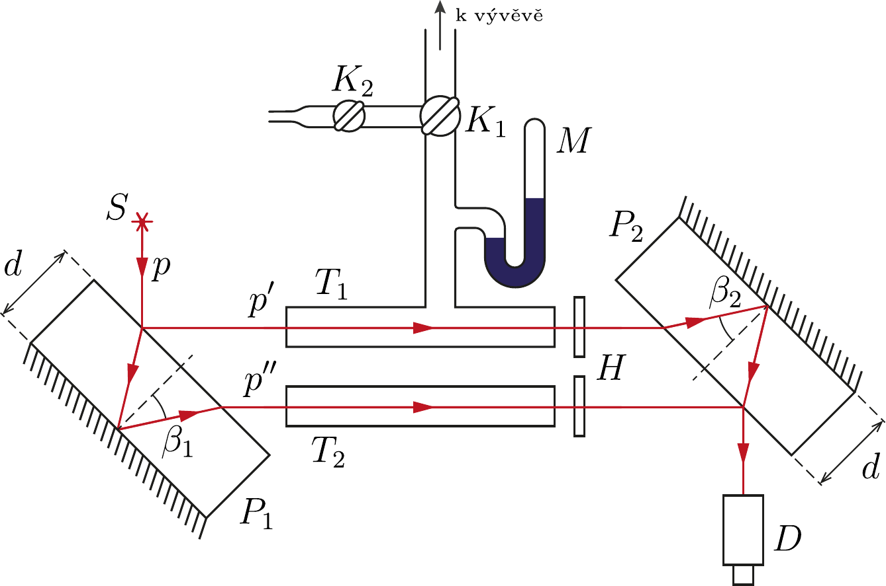
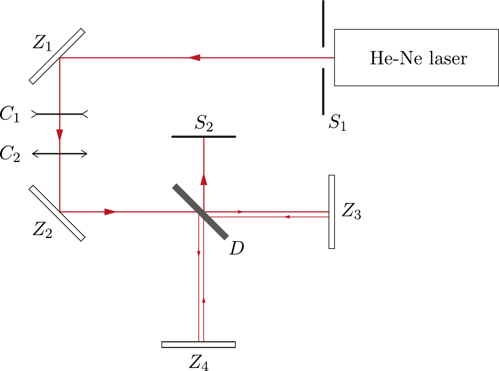
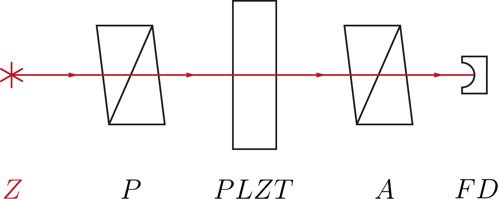
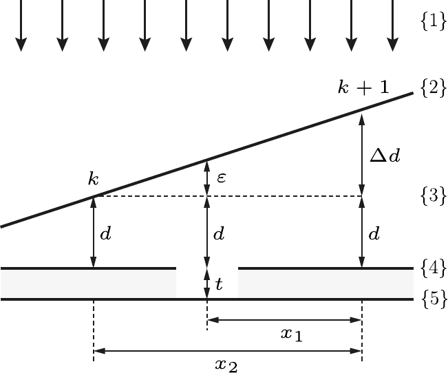
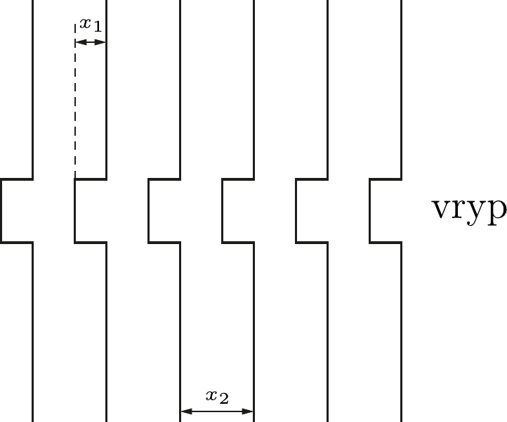

# Katalog náčrtků -- Praktikum III

Tento katalog obsahuje náčrtky, schémata aparatur a uspořádání k úlohám v rámci Praktika III - Optika.

## [NOFY028] Úloha III

### Schéma mřížkového spektrometru

*[Stáhnout v původním PDF formátu]([NOFY028]_Uloha_III_Schema.pdf)*

## [NOFY028] Úloha VI

### Schéma použité aparatury

*[Stáhnout v původním PDF formátu]([NOFY028]_Uloha_VI_Schema.pdf)*

## [NOFY028] Úloha VII

### Schéma použité aparatury

*[Stáhnout v původním PDF formátu]([NOFY028]_Uloha_VII_Schema.pdf)*

## [NOFY028] Úloha IX

### Schéma dvouhranolového refraktometru Abbeova typu

*[Stáhnout v původním PDF formátu]([NOFY028]_Uloha_IX_Schema_1.pdf)*

### Schéma Abbeova polokulového refraktometru

*[Stáhnout v původním PDF formátu]([NOFY028]_Uloha_IX_Schema_2.pdf)*

## [NOFY028] Úloha XIX

### Schéma Jaminova interferometru

*[Stáhnout v původním PDF formátu]([NOFY028]_Uloha_XIX_Schema.pdf)*

## [NOFY028] Úloha XX

### Schéma Michelsonova interferometru

*[Stáhnout v původním PDF formátu]([NOFY028]_Uloha_XX_Schema.pdf)*

## [NOFY028] Úloha XXVII

### Schéma měřící aparatury

*[Stáhnout v původním PDF formátu]([NOFY028]_Uloha_XXVII_Schema.pdf)*

## [NOFY028] Úloha XXX

### Vznik interferenčních proužků

*[Stáhnout v původním PDF formátu]([NOFY028]_Uloha_XXX_Schema_1.pdf)*

### Obraz měřené vrstvy

*[Stáhnout v původním PDF formátu]([NOFY028]_Uloha_XXX_Schema_2.pdf)*
